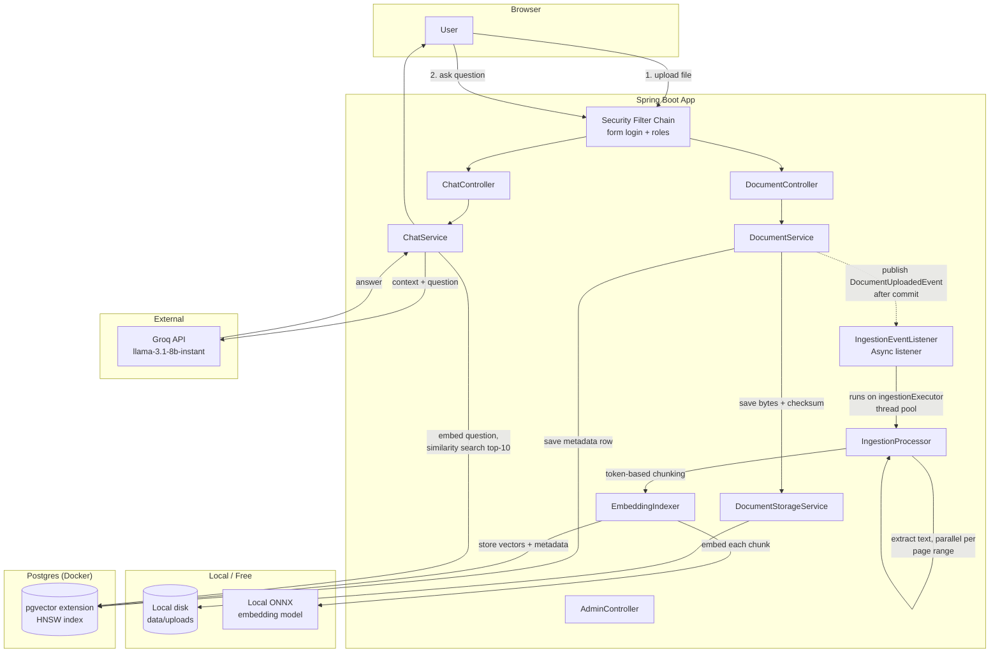
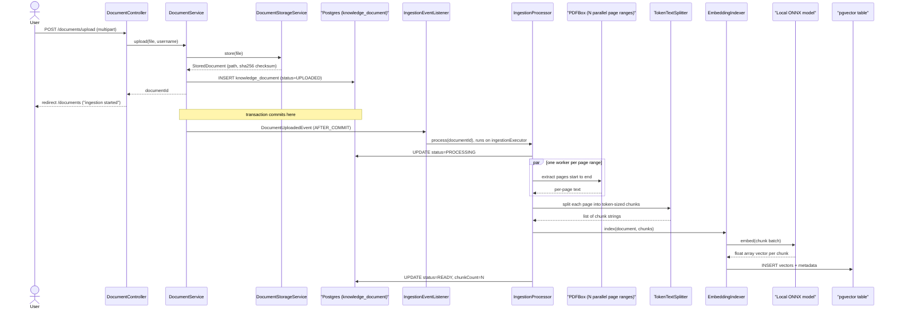
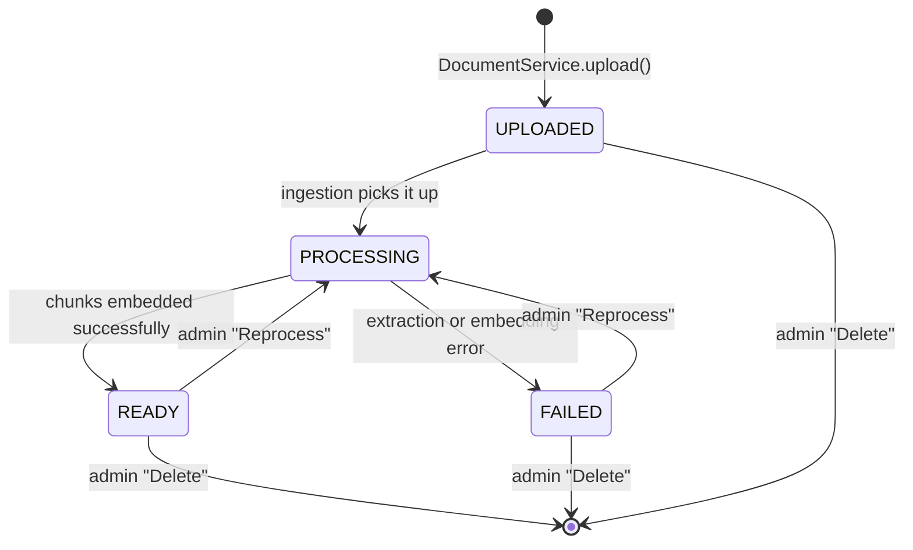
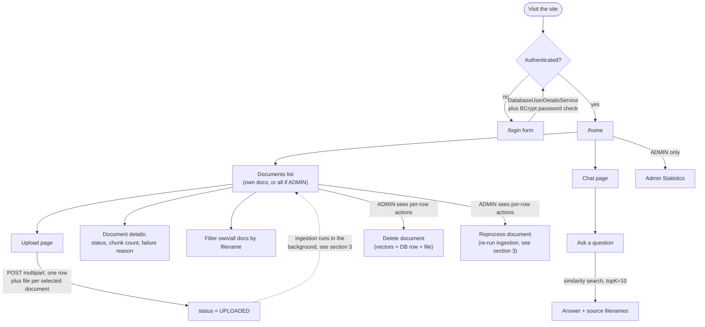

# Insight Vault

A Spring Boot application that lets users upload documents, indexes them into a vector
database, and answers natural-language questions about their content using
Retrieval-Augmented Generation (RAG).

This document is meant to be read top-to-bottom as a refresher: what RAG is, how this
specific app implements it, how a request actually flows through the code, and how to
get it running locally.

---

## 1. What is RAG, in this app's terms?

A plain LLM only knows what it was trained on — it can't answer questions about *your*
private MySQL performance book or *your* resume PDF. **Retrieval-Augmented Generation**
fixes that by doing two things at answer-time instead of one:

1. **Retrieve** — search your own documents for the passages most relevant to the
   question.
2. **Generate** — hand those passages to an LLM as context and ask it to answer using
   only that context.

To make step 1 possible, every uploaded document has to be pre-processed once, ahead of
time, into a searchable form. That pre-processing is called **ingestion**, and it's the
more complex half of this codebase.

### Concepts you need before the flow makes sense

| Concept | What it means here |
|---|---|
| **Chunking** | An LLM context window and a similarity search both work better on small, focused passages than on a whole 800-page book. So every document is split into many small text **chunks** (a few hundred tokens each) before anything else happens. |
| **Embedding** | A chunk of text is converted into a fixed-length vector of floats (an *embedding*) such that semantically similar text produces vectors that are close together in that vector space. This app computes embeddings **locally** using a small ONNX transformer model — no API call, no cost. |
| **Vector store** | A database that can store embeddings and, given a query embedding, quickly find the nearest ones (*similarity search*). This app uses **pgvector**, a Postgres extension, with an **HNSW** index (a graph-based structure for fast approximate nearest-neighbor search) and **cosine distance** as the similarity metric. |
| **Top-K retrieval** | When a question comes in, it's embedded the same way, and the vector store returns the *K* closest chunks (K=10 here) — the ones most likely to contain the answer. |
| **Prompt assembly / grounding** | The retrieved chunks are concatenated into a "Context:" block and sent to the chat LLM alongside the question, with a system prompt instructing it to answer *from that context* rather than its own training data. |

---

## 2. Architecture overview



### The two flows, in prose

**Ingestion (write path)** — happens once per uploaded document, asynchronously:
1. `DocumentController.upload()` receives the multipart file.
2. `DocumentService.upload()` validates size, saves the raw file to disk via
   `DocumentStorageService` (SHA-256 checksum computed, filename UUID-prefixed to avoid
   collisions), and inserts a `KnowledgeDocument` row with status `UPLOADED`.
3. After the DB transaction commits, a `DocumentUploadedEvent` fires.
   `IngestionEventListener` picks it up **asynchronously** on a dedicated thread pool
   (`ingestionExecutor`) — so the HTTP request returns immediately; ingestion doesn't
   block the upload response.
4. `IngestionProcessor.process()` does the actual work:
   - Marks the document `PROCESSING`.
   - Extracts text. For PDFs, the page range is split across CPU cores and each range
     is parsed in parallel using PDFBox directly (`ForkPDFLayoutTextStripper`, a
     layout-aware stripper that preserves table/column structure — important for
     technical content full of code listings). Non-PDF files go through Apache Tika.
   - Splits the extracted per-page text into token-sized chunks (`TokenTextSplitter`).
   - Hands the chunks to `EmbeddingIndexer`, which tags each chunk with metadata
     (`document_id`, `owner_user_id`, `source_name`, `chunk_number`) and writes them to
     the `applicationVectorStore` bean — this is where the local embedding model
     actually runs and the resulting vectors land in Postgres/pgvector.
   - Marks the document `READY` with its final chunk count, or `FAILED` with a reason.

**Chat (read path)** — happens per question, synchronously:
1. `ChatController.ask()` receives the question.
2. `ChatService.answer()` embeds the question and runs a top-10 similarity search
   against the vector store.
3. The matched chunks are joined into a context block; their `source_name` metadata
   becomes the "sources" shown to the user.
4. A system prompt + context + question is sent to the chat model (routed through
   Groq's OpenAI-compatible endpoint, model `llama-3.1-8b-instant`) — this is the one
   part of the pipeline that's *not* free/local.
5. The model's answer and the list of source document names are returned to the browser.

---

## 3. Document ingestion — deep dive

This is the pipeline that turns an uploaded file into searchable vectors. It runs once
per document, fully in the background.



### Document status lifecycle



### Stage by stage, with the concept each stage depends on

1. **File intake & persistence.** `DocumentStorageService` writes the raw bytes to
   `app.storage.root-location` (`./data/uploads`) under a UUID-prefixed filename (avoids
   collisions and directory traversal from a hostile original filename) and computes a
   SHA-256 checksum. *Concept:* blob storage (the file bytes on disk) is kept separate
   from metadata storage (the `knowledge_document` row in Postgres) — the DB never holds
   the file content itself, only a path to it.

2. **Decoupling upload from processing (event-driven ingestion).** `DocumentService`
   publishes a `DocumentUploadedEvent` after the upload transaction commits
   (`@TransactionalEventListener(phase = AFTER_COMMIT)`), and
   `IngestionEventListener` handles it `@Async` on a dedicated `ingestionExecutor` thread
   pool. *Concept:* this is the producer/consumer pattern applied to a web request —
   the HTTP thread returns to the browser immediately after saving the file and DB row;
   a worker thread does the (potentially slow, multi-minute-for-a-large-book) extraction
   and embedding work separately. Firing the event only *after commit* matters: a worker
   picking it up any earlier could look up a document row that isn't visible yet in the
   database.

3. **Parallel text extraction.** For PDFs, `IngestionProcessor` first counts pages, then
   splits the page range into one chunk per available CPU core and extracts each range
   concurrently (`parallelStream()`), each worker opening its **own** `PDDocument`
   instance to avoid sharing mutable PDFBox state across threads. Extraction itself uses
   `ForkPDFLayoutTextStripper` — a layout-aware stripper (bundled with Spring AI) that
   reconstructs column/table spacing instead of emitting a raw stream of words, which
   matters for technical documents full of code listings and tables. Non-PDF files
   (`.docx`, `.txt`, etc.) go through Apache Tika instead. *Concept:* this is
   data-parallelism — the same operation (text extraction) applied independently to
   different slices of the same input, safe here because each page's text doesn't
   depend on any other page's.

4. **Token-aware chunking.** `TokenTextSplitter` (defaults: ~800 tokens per chunk,
   counted with the same `jtokkit` tokenizer family used by OpenAI-style models; a
   350-character minimum chunk size; trims on punctuation boundaries rather than
   mid-sentence) runs independently over each page's extracted text. *Concept:*
   chunking exists because both similarity search and the LLM's context window work
   better on small, focused passages than on a whole book — but too small and you lose
   surrounding context the LLM would need to answer well. 800 tokens is a common,
   reasonable middle ground.

5. **Local embedding generation.** `EmbeddingIndexer` tags every chunk with metadata
   (`document_id`, `owner_user_id`, `source_name`, `chunk_number`) and hands the whole
   batch to the vector store in one call. Under the hood, the configured embedding
   model (`spring.ai.model.embedding=transformers`) tokenizes the batch and runs it
   through a **single ONNX Runtime session** rather than one inference call per chunk —
   this batching is what keeps local, CPU-only embedding fast enough to be practical.
   *Concept:* this whole step runs with no network call and no per-token cost — it's the
   "free" half of the pipeline.

6. **Vector persistence & indexing.** The batch of `(vector, chunk text, metadata)`
   tuples is written into pgvector's table, which maintains an **HNSW** index over the
   vectors for fast approximate nearest-neighbor lookup at query time. The per-chunk
   metadata is what makes later operations like "delete all vectors for this document"
   (used by both document deletion and reprocessing) a simple filtered delete rather
   than a full-table scan.

7. **Status lifecycle & idempotent reprocessing.** The document's `status` field is the
   single source of truth the UI reads (`documents/list`, `documents/details`,
   `admin/statistics`). Admin "Reprocess" deletes the document's existing vectors by a
   `document_id` filter and republishes the same `DocumentUploadedEvent`, re-running the
   entire pipeline above from scratch — this is exactly the mechanism you'd use to
   regenerate chunks for an already-uploaded document after fixing a bug in extraction
   or chunking, without asking the user to re-upload the file.

8. **Failure isolation.** `IngestionProcessor.process()` wraps the whole pipeline in a
   single try/catch: any exception (unreadable PDF, extraction error, embedding
   failure) marks the document `FAILED` with a reason instead of propagating. *Concept:*
   this keeps one bad file from crashing the shared thread pool or blocking the other
   documents queued behind it.

---

## 4. User flow — deep dive



### Walking through it, with the concept behind each step

- **Authentication & session.** Spring Security's default form login: a session cookie
  is issued after `DatabaseUserDetailsService` loads the user from Postgres and the
  submitted password is checked against the stored BCrypt hash. *Concept:* this is
  classic server-side session auth (not a stateless JWT) — the session, not a token the
  browser has to attach manually, is what keeps you logged in across requests.
- **Role-based access control, enforced twice.** `SecurityConfiguration` gates whole URL
  prefixes (`/admin/**` → `ROLE_ADMIN`; `/documents/**`, `/chat/**` → any authenticated
  role), and `@PreAuthorize("hasRole('ADMIN')")` on `AdminController` /
  `AdminDocumentService` / `StatisticsService` re-checks the same rule at the method
  level. *Concept:* defense in depth — even a misconfigured route mapping can't bypass
  the method-level check underneath it.
- **Multi-tenancy on the documents list.** `DocumentService.findVisibleDocuments()`
  scopes the query to `owner.username` for a normal user; an admin gets every document
  from every user. This is the main place tenant isolation is actually enforced.
- **A nuance worth knowing: chat retrieval is not tenant-scoped.**
  `ChatService.answer()` runs `vectorStore.similaritySearch()` with no
  `owner_user_id`/`document_id` filter — so a question from any logged-in user can
  retrieve and get answered from chunks that were embedded from *any* user's uploaded
  documents, not just their own. That's a real, current gap relative to the tenancy
  model the documents list enforces — worth keeping in mind if this ever moves past a
  single-team MVP.
- **Upload UX.** Multiple files can be submitted in one form post; each is stored and
  saved independently inside its own try/catch, so one bad file doesn't stop the others
  from uploading. The controller uses the Post/Redirect/Get pattern (redirect + flash
  message after a successful POST) so refreshing the documents page never resubmits the
  upload.
- **Status polling is manual.** There's no push/websocket update — a document's status
  only changes on screen when the user (re)loads the documents list or the document
  details page, by which point the background ingestion may or may not have finished.
- **Chat sourcing.** Every answer includes the distinct `source_name` values of whichever
  chunks were retrieved, so the user can tell which document(s) an answer came from —
  though not which page or chunk specifically.
- **Admin operations.** *Delete* removes the document's vectors (by `document_id`
  filter), its Postgres row, and its file on disk. *Reprocess* only wipes the vectors and
  re-runs ingestion — the original uploaded file is untouched, which is exactly the
  lever you'd use to regenerate a document's chunks after a fix to the extraction or
  chunking logic, without asking the user to re-upload anything.

---

## 5. Other things worth understanding

- **Multi-tenancy / authorization.** Every document has an `owner`. A normal `ROLE_USER`
  only sees their own documents (`DocumentService.findVisibleDocuments`); `ROLE_ADMIN`
  sees everything and can delete or trigger reprocessing (`AdminController`,
  `AdminDocumentService`). Reprocessing deletes the old vectors by
  `document_id` filter and re-publishes the upload event to run ingestion again.
- **Security.** `SecurityConfiguration` is a standard Spring Security form-login setup:
  `/admin/**` requires `ROLE_ADMIN`, `/documents/**` and `/chat/**` require any
  authenticated user, everything else requires authentication. Users are loaded from
  the DB (`DatabaseUserDetailsService`); passwords are BCrypt-hashed.
  `AuthenticationAuditListener` logs login success/failure.
- **Bootstrap users.** On startup, `UserService` creates a default admin and a default
  user if they don't already exist (see `app.bootstrap.*` properties below) — convenient
  for local dev, not something you'd want verbatim in production.
- **Why the embedding model is "free".** `spring.ai.model.embedding=transformers` uses
  Spring AI's local ONNX-runtime-backed model (all-MiniLM, downloaded once and cached)
  instead of calling an embeddings API — no network call, no per-token cost, runs on
  your own CPU.
- **Why chat still needs a key.** `spring.ai.model.chat=openai` is Spring AI's generic
  "OpenAI-protocol" chat client, but `spring.ai.openai.base-url` points it at Groq
  instead of OpenAI. You still need an API key (Groq's, despite the `openai.*` property
  names) for the chat step only — ingestion needs no external credentials at all.
- **Concurrency tuning.** `AsyncConfiguration.ingestionExecutor` sizes its thread pool
  off `Runtime.getRuntime().availableProcessors()`, so multiple uploaded documents
  ingest concurrently, bounded by your machine's cores.

---

## 6. Frontend / UI

There's no separate frontend project here — no `package.json`, no bundler, no SPA
framework. The whole UI is server-rendered and ships inside the same Spring Boot jar.

| Layer | Technology | Where |
|---|---|---|
| Templating | **Thymeleaf** (`spring-boot-starter-thymeleaf`) | `src/main/resources/templates/*.html` |
| Role-aware rendering | **thymeleaf-extras-springsecurity6** (`sec:authorize`) | e.g. hiding the Statistics nav link from non-admins |
| Interactivity | Plain **vanilla JavaScript**, inline `<script>` per page — no framework, no build step | `chat.html`, `documents/upload.html` |
| Styling | One hand-written **CSS file** using custom properties as design tokens — no Bootstrap/Tailwind | `static/css/application.css` (~650 lines) |

### Concepts behind the frontend choices

- **Server-side rendering (MPA), not a SPA.** Every nav link (`Overview`, `Documents`,
  `Upload`, `Chat`, `Statistics`) is a full page navigation: the browser requests a URL,
  a `@Controller` method builds a `Model` and returns a Thymeleaf view name, and
  Thymeleaf renders complete HTML server-side. *Concept:* this is the classic
  Multi-Page Application model — simpler and more resilient than a single-page app
  (nothing to hydrate, no client-side router, works with JavaScript disabled for every
  page except Chat) at the cost of a full page reload per navigation.
- **One exception: the chat widget is a small SPA-like island.** `chat.html` doesn't
  reload the page per message — its inline script does `fetch('/chat/ask', ...)`,
  appends the user's question and the JSON response to the DOM directly, and manages
  its own "Thinking..." placeholder state. *Concept:* progressive enhancement in
  reverse — most of the app is plain server-rendered pages, with JavaScript reserved
  for the one interaction (a conversational back-and-forth) that genuinely needs it.
- **CSRF handling for the one AJAX call.** Spring Security's CSRF protection is on by
  default for a session-based app like this one. Regular `<form method="post">`
  submissions (upload, logout) don't need any special handling — Thymeleaf's Spring
  Security integration inserts the CSRF token as a hidden field automatically. The
  `fetch()`-based chat call can't rely on that, so `chat.html` renders the token and
  header name into `<meta>` tags server-side and its script reads them into a request
  header before calling `fetch`. *Concept:* CSRF tokens protect state-changing
  requests from being forged by a different site — anything that bypasses normal form
  submission (like a manual `fetch`) has to carry the token explicitly.
- **Progressive enhancement on the upload page.** The `<input type="file" multiple>`
  in `documents/upload.html` already works with zero JavaScript — the browser's native
  file picker and the plain multipart form submission are enough to upload. The inline
  script only adds a "selected files" preview list on top of that, purely cosmetic;
  disabling JavaScript would still let you upload documents, just without the preview.
- **Role-conditional rendering is cosmetic, not the security boundary.**
  `sec:authorize="hasRole('ADMIN')"` hides the *Statistics* link in the nav for
  non-admins, but hiding a link is not what stops a non-admin from reaching
  `/admin/statistics` directly — that's enforced independently server-side by
  `SecurityConfiguration`'s URL matcher and `@PreAuthorize` (see section 4). *Concept:*
  never rely on hiding a UI element as your actual access control.
- **Design tokens via CSS custom properties.** `application.css` defines its whole dark
  color palette once at the top (`--bg`, `--primary`, `--success`, `--danger`, etc.) and
  every page/component (`.card`, `.button.primary`, `.stat-card`, `.chat-bubble`,
  `.dropzone`) reuses those variables instead of hardcoding colors. *Concept:* this is a
  lightweight, framework-free version of what a design system gives you — one place to
  change the palette, consistent look across every server-rendered page.
- **No build pipeline.** Static assets under `src/main/resources/static/` are served
  as-is by Spring Boot's built-in static resource handling — there's no `npm install`,
  no transpilation, no minification step. What's on disk is exactly what the browser
  receives.

---

## 7. Project layout

```
src/main/java/.../insightvault/
├── controller/     # HTTP endpoints (Home, Login, Document, Chat, Admin)
├── service/        # Business logic: upload, storage, ingestion, embedding, chat, stats
├── security/       # Spring Security wiring, user details, login audit logging
├── config/         # Vector store bean, async executor, storage/bootstrap properties
├── models/         # DTOs, enums (DocumentStatus, RoleName), events
├── models/entity/  # JPA entity (KnowledgeDocument)
└── repository/     # Spring Data JPA repositories

src/main/resources/
├── templates/      # Thymeleaf views (login, home, documents/*, chat, admin/statistics)
└── static/css/     # application.css — the whole design system, one file
```

---

## 8. Running it locally

### Prerequisites
- Java 21
- Docker (for Postgres + pgvector)
- A Groq API key (free tier works) for the chat model — get one at
  console.groq.com. Ingestion/embeddings need no key.

### 1. Start Postgres with pgvector

```bash
docker run -d --name insight-vault-postgres \
  -e POSTGRES_DB=postgres \
  -e POSTGRES_USER=postgres \
  -e POSTGRES_PASSWORD=postgres123 \
  -p 5432:5432 \
  pgvector/pgvector:pg16
```

(If the container already exists from a previous session, just `docker start
insight-vault-postgres`.) The app creates its own tables and the pgvector HNSW index on first
run — nothing to migrate manually (`spring.jpa.hibernate.ddl-auto=update`,
`initializeSchema(true)` on the vector store bean).

### 2. Set the chat model API key

```bash
export OPENAI_API_KEY=<your-groq-api-key>
```

(Spring's relaxed property binding maps `OPENAI_API_KEY` to the `openai.api-key`
placeholder used in `application.properties`.)

### 3. Run the app

```bash
./mvnw spring-boot:run
```

The app starts on `http://localhost:8080`.

### 4. Log in

Default bootstrapped accounts (see `app.bootstrap.*` in `application.properties`):

| Role | Username | Password |
|---|---|---|
| Admin | `admin` | `admin123` |
| User | `user` | `user123` |

From there: **Documents → Upload** to ingest a file, **Chat** to ask questions about
what you've uploaded, **Admin → Statistics** (admin only) for ingestion counts and
storage stats.

---

## 9. Quick glossary (for the "wait, what was that again?" moment)

- **RAG (Retrieval-Augmented Generation)** — answering questions by retrieving relevant
  private text and feeding it to an LLM as context, instead of relying on the model's
  training data alone.
- **Embedding** — a vector representation of text such that semantic similarity ≈
  geometric closeness.
- **Chunking** — splitting long documents into smaller pieces before embedding, so
  retrieval is precise and each piece fits comfortably in a prompt.
- **Vector store / similarity search** — a database specialized in storing embeddings
  and finding the nearest ones to a query vector.
- **HNSW (Hierarchical Navigable Small World)** — the graph-based index structure
  pgvector uses here for fast approximate nearest-neighbor search at scale.
- **Cosine distance** — the similarity metric used to compare embedding vectors
  (measures angle between vectors, ignoring magnitude).
- **Top-K retrieval** — returning the K most similar chunks to a query (K=10 in
  `ChatService`).
- **Grounding** — instructing the LLM (via the system prompt) to answer from the
  supplied context rather than its own general knowledge.
